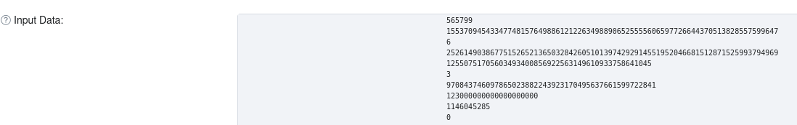

# Starknet Messaging Bridge Writeup #

Hi, my name is Juan, i wrote this writeup to gain experience and help others to understand Starknet. 

Any comments/corrections please reach me at my twitter account: [@devnet0x](https://twitter.com/devnet0x/)

## Exercise 0 - Send an L2→L1→L2 message with existing contracts (2 pts) ##

Open evaluator [contract](https://goerli.voyager.online/contract/0x595bfeb84a5f95de3471fc66929710e92c12cce2b652cd91a6fef4c5c09cd99#writeContract) and go to ex_0_a function to add your L1 (goerli) account and some amount. In this example i will use 123 tokens (remember this token have 18 decimals).

Now, let's wait for our message to be sent to L1 (wait around 30 minutes).

We can see L1 hash transaction in bottom page:

Now, before minting our tokens in L1, we need to know the secret number (which in fact, is not secret because is stored in the blockchain). To know this number, we analize ex_0_a function and we can see this secret number used as parameter and sended to L1 (line 137):

So, we must go to goerli.etherscan.io and search our L1 hash transaction:

To get received parameters, press “click to see more” and in "input data" press "decode input data" button. Now, we can see all three parameters in decimal (account number, amount and secret number):

Thus, now let's go to dummy token on L1 ([link](https://goerli.etherscan.io/address/0x0232CB90523F181Ab4990Eb078Cf890F065eC395#writeContract)), connect our wallet and execute Mint with the amount and secret number.

Confirm our transaction in the wallet:

Now, let's execute i_have_tokens function which is processed by ex_0_b. If we analyze this function, we can see that validated secret number must have the original secret number (substract 32 as we can see prevously in line 135):

And confirm our transaction in the wallet to get our points

Also, we can go to L2 contract evaluator and verify received message

[received transaction](https://goerli.voyager.online/contract/0x0595bfeb84a5f95de3471fc66929710e92c12cce2b652cd91a6fef4c5c09cd99#transactions):

[received message](https://goerli.voyager.online/tx/0x13bbc32d32bcfb6c6da5f1c3991e53b9c3e66538805cfdccb05f9f1ad4507e8#messages)

Done.

## Exercise 1 - Send an L2→L1 message with your contract (2 pts) ##

Write a contract on L2 that will send a message to L1 MessagingNft and trigger createNftFromL2. Your function should be called create_l1_nft_message. As we can see in L1 consumer contract, what we need to send as payload is L1 account address (msg.sender):

So, our contract is:
          

Now, lets deploy our contract in L2:

Then, submit the contract address to L2 Evaluator by calling [submit_exercise](https://goerli.voyager.online/contract/0x595bfeb84a5f95de3471fc66929710e92c12cce2b652cd91a6fef4c5c09cd99#writeContract) function:

      

Call ex1a of L2 Evaluator to trigger the message sending to L1 (using yout L1 account number as parameters):

In the background, ex1a will call our create_l1_nft_message created function:

Wait (30 minutes aprox.) to receive message in L1.

In page bottom you will see your L1 transaction hash who received the message:

And, if you follow the link, you will see (in [logs](https://goerli.etherscan.io/tx/0xc3ebd92183cfb838cce9d93828add75fd36c25d09090b1081a3aa973cc65bd0b#eventlog) tab) the received message in L1 with L1 account address:

Now, call [createNftFromL2](https://goerli.etherscan.io/address/0x6DD77805FD35c91EF6b2624Ba538Ed920b8d0b4E#writeContract) in L1 MessagingNft to trigger the message consumption on L1 
          

And, in goerli [transaction](https://goerli.etherscan.io/tx/0x3e55f74faf45f169bc7d597ad48b7983de083f4c66f6eac709fac8ce4b6b084e#eventlog) we can see our consumed message:

Done, L1 MessagingNft will sends back a message to L2 to credit your points on L2: 

[(Source Code)](./src/l1l2.cairo)

## Exercise 2 - Send an L1→L2 message with your contract (2 pts) ##

(..soon)