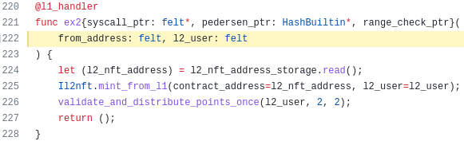
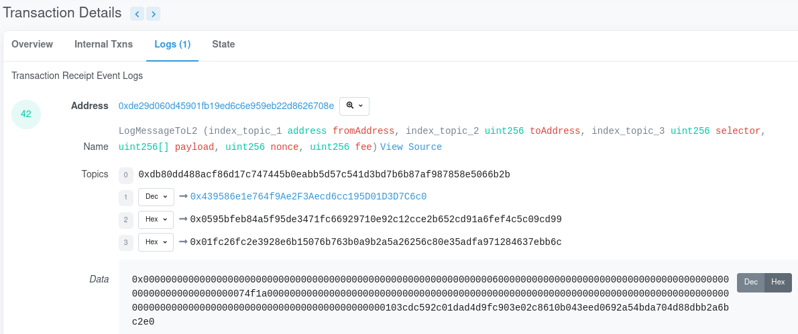
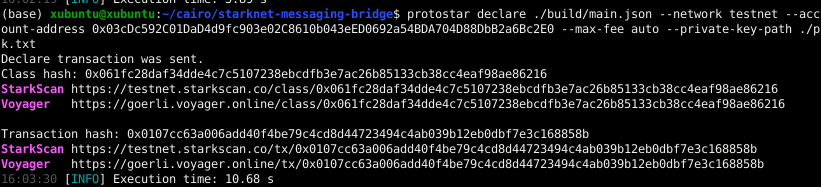

# Starknet Messaging Bridge Writeup #

Hi, my name is Juan, i wrote this writeup to gain experience and help others to understand Starknet messages resolving [Starknet Messaging Bridge workshop](https://github.com/starknet-edu/starknet-messaging-bridge). This writeup is full of spoilers so try to resolve by your own before moving forward with each step:

I will appreciate any comments/corrections so please find me at my twitter account: [@devnet0x](https://twitter.com/devnet0x/).

Index:

[exercise-0---send-an-l2→l1→l2-message-with-existing-contracts-2-pts](#0)

[exercise-1---send-an-l2→l1-message-with-your-contract-2-pts](#1)

[exercise-2---send-an-l1→l2-message-with-your-contract-2-pts](#2)

[exercise-3---receive-an-l2→l1-message-with-your-contract-2-pts](#3)

[exercise-4---receive-an-l1→l2-message-with-your-contract-2-pts](#4)

## Exercise 0 - Send an L2→L1→L2 message with existing contracts (2 pts) ##

Open evaluator [contract](https://goerli.voyager.online/contract/0x595bfeb84a5f95de3471fc66929710e92c12cce2b652cd91a6fef4c5c09cd99#writeContract) and go to ex_0_a function to add your L1 (goerli) account and some amount. In this example i will use 123 tokens (remember this token have 18 decimals).

Now, let's wait for our message to be sent to L1 (wait around 30 minutes).

We can see L1 hash transaction in bottom page:

Now, before minting our tokens in L1, we need to know the secret number (which in fact, is not secret because is stored in the blockchain). To know this number, we analize ex_0_a function and we can see that secret number is used as parameter in payload and sended to L1 inside the message (lines 135 and 137) (dont forget that stored secret_value is different than sended secret_value which add 32):

So, we must go to goerli.etherscan.io and search our L1 hash transaction:

To get received parameters, press “click to see more” and in "input data" press "decode input data" button. Now, we can see all three parameters in decimal (account number, amount and secret number):

Thus, now let's go to dummy token on L1 ([link](https://goerli.etherscan.io/address/0x0232CB90523F181Ab4990Eb078Cf890F065eC395#writeContract)), connect our wallet and execute Mint with the amount and secret number.

Confirm our transaction in the wallet:

Now, let's execute i_have_tokens function which is processed by ex_0_b. If we analyze this function (line 159), we can see that validated secret number must have the original stored secret number (substract 32 as we previously saw were added in line 135):

And confirm our transaction in the wallet to get our points

Also, we can go to L2 contract evaluator and verify received message

[received transaction](https://goerli.voyager.online/contract/0x0595bfeb84a5f95de3471fc66929710e92c12cce2b652cd91a6fef4c5c09cd99#transactions):

[received message](https://goerli.voyager.online/tx/0x13bbc32d32bcfb6c6da5f1c3991e53b9c3e66538805cfdccb05f9f1ad4507e8#messages)

Done.

## Exercise 1 - Send an L2→L1 message with your contract (2 pts) ##

Write a contract on L2 that will send a message to L1 MessagingNft and trigger createNftFromL2. Your function should be called create_l1_nft_message. As we can see in L1 consumer contract, what we need to send as payload is L1 account address (msg.sender):

So, our contract is:
          

Now, lets deploy our contract in L2:

Then, submit the contract address to L2 Evaluator by calling [submit_exercise](https://goerli.voyager.online/contract/0x595bfeb84a5f95de3471fc66929710e92c12cce2b652cd91a6fef4c5c09cd99#writeContract) function:

      

Call ex1a of L2 Evaluator to trigger the message sending to L1 (using yout L1 account number as parameters):

In the background, ex1a will call our create_l1_nft_message created function:

Wait (30 minutes aprox.) to receive message in L1.

In page bottom you will see your L1 transaction hash who received the message:

And, if you follow the link, you will see (in [logs](https://goerli.etherscan.io/tx/0xc3ebd92183cfb838cce9d93828add75fd36c25d09090b1081a3aa973cc65bd0b#eventlog) tab) the received message in L1 with L1 account address:

Now, call [createNftFromL2](https://goerli.etherscan.io/address/0x6DD77805FD35c91EF6b2624Ba538Ed920b8d0b4E#writeContract) in L1 MessagingNft to trigger the message consumption on L1 
          

And, in goerli [transaction](https://goerli.etherscan.io/tx/0x3e55f74faf45f169bc7d597ad48b7983de083f4c66f6eac709fac8ce4b6b084e#eventlog) we can see our consumed message:

Done, L1 MessagingNft will sends back a message to L2 to credit your points on L2: 

[(Source Code)](./src/l1l2.cairo)

## Exercise 2 - Send an L1→L2 message with your contract (2 pts) ##

We need to write and deploy a contract on L1 that sends messages to L2. This contract on L1 must send a message to L2 Evaluator and trigger ex2 function. 

So, at first we analize ex2 function and review if we need to call it with parameters. As you can see, ex2 have 2 parameters but the first (from_address) is filled by starknet OS, so we only need to send the second parameter (l2_user):

Then, this is our L1 contract which will call our function in solidity (using remix):

where:

L2ContractAddress: L2 evaluator contract address.

L2ContractSelector: Obtained by calling this function in python using function name as documented [here](https://starknet.io/docs/hello_starknet/l1l2.html#receiving-a-message-from-l1).

l2_user: Our L2 user address.

starknetCore: Obtained using this instruction as indicated in the exercise [instructions](https://github.com/starknet-edu/starknet-messaging-bridge#exercise-2---send-an-l1l2-message-with-your-contract-2-pts):

Now, lets deploy our contract in L1 goerli and execute our sendMsgToL2() function:

After execute our function we can get the L1 goerli transaction hash:

And search our transaction hash in [etherscan](https://goerli.etherscan.io/tx/0xd4f8e40c96a9cc35adbddc2ec690b54a7605705b016ae5bd6609bec3bb6dfa5d#eventlog) to find:

Topic 2 : With destination address in L2.

Data    : With parameters sended from L1 to L2 (in this case with our L2 account number)

Now we can go to L2 to search our [message](https://goerli.voyager.online/contract/0x0595bfeb84a5f95de3471fc66929710e92c12cce2b652cd91a6fef4c5c09cd99#messages) in voyager:

And click in [message hash](https://goerli.voyager.online/message/0xb1556cc8c7e4cb3ee8f3362f0fe2f71a7edbcbdf0bb319933c51e154428865c4) to watch message details:

Finally, your points are automatically attributed on L2.

[(Source Code)](./src/l1.sol)

## Exercise 3 - Receive an L2→L1 message with your contract (2 pts) ##

We must write a contract on L1 that will receive a message from from function ex3_a. 
To make sure our contract is able to handle the message we must analyze the function which will send the message and take note about parameters.
           

So, we must use one parameter in payload (l2 user account) and call our function as consumeMessage with two parameters as specified in ex3 contract on L1 (line 51):

Then, this will be our contract on remix:

Now connect your metamask wallet (select option inyected provider) and select "L1ConsumerContract":  

Then press deploy button and confirm in metamask:

Once deployed on L1 goerli, we will see our contract address in "Deployed Contracts" section:

Now, call ex3_a of L2 Evaluator to send an L2→L1 message (using previous L1 contract address): 

And wait 30 minutes to confirm our message was received on L1:
      

Call ex3 of L1 Evaluator, which triggers message consumption from your L1 contract 

L1 evaluator will also send back a message to L2 to distribute your points 

[(Source Code)](./src/l1consumer.sol)

## Exercise 4 - Receive an L1→L2 message with your contract (2 pts) ##

In this exercise, we must write an L2 contract that be able to receive a message from ex4 of L1 Evaluator. So, when we analyze ex4 function we can see we will need to receive one value with the random number as payload.

And, something additional in ex4_b validator function use a second call (to l1_assigned_var) to validate that we know the random number:

Then, we write our L2 contract in cairo with 2 functions (one custom that will be called by the message and a second that will be called by ex4_b validator). Please note that our custom function must have [@l1_handler](https://www.cairo-lang.org/docs/hello_starknet/l1l2.html#receiving-a-message-from-l1) as decorator (this give me a great headache because without this decorator message fails..:) ) 

Now, we compile our contract on L2:

Declare his class:

And deploy to Starknet goerli L2:

Now, we call ex4 of L1 Evaluator to send the random value out to your L2 contract, but before we must need to calculate selector to call our custom function: 
      

      
Submit your L2 contract address by calling submit_exercise of L2 Evaluator:

      
And finally, call ex4_b of L2 Evaluator that will check you completed your work correctly and distribute your points:

[(Source Code)](./src/l2receiver.cairo)

Well done, i hope this writeup has been useful for you and i will be waiting for your github stars!!!...:)

Please check my other [published writeups](https://github.com/devnet0x).
