# A-Maze-X Writeup #

Hi, my name is Juan, i wrote this writeup to gain some Smart Contract Auditor experience. I previously resolved other challenges as Ethernaut and CaptureTheEther so i recommend try them before get into this more advanced Defi challenges so i will asume you have a previous basic knowledge.

Thanks to @mattaereal and @patrickd_de for their in deep writeups which help me to understand the vulnerability behind this challenges (totally recommended visit their blogs with a lot more of security information).
I used hardhat to resolve all these challenges so please feel free to delete all console.log lines i used to debug trying to reach the solution (I left them with the hope that they can help you for a better understanding).

Any comments/corrections please reach me at my twitter account: [@devnet0x](https://twitter.com/devnet0x/)

## Challenge 0: VitaToken seems safe, right? ##
The key in this challenge is ask ourself: why VToken needs to override the openzepelin current implementation?. So you compare both functions:
Vtoken:

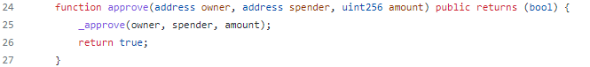

Openzepelin:(https://github.com/OpenZeppelin/openzeppelin-contracts/blob/master/contracts/token/ERC20/ERC20.sol)

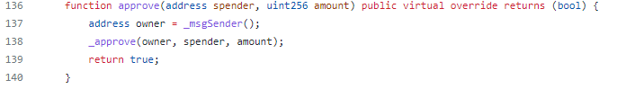

What you can see is tha VToken doesn’t use msg.sender to set the owner who allows use his tokens. What this means?...that if you call approve function, you can allow transfer tokens in behalf of any owner you set as parameter.
Then what we can do?, One way, is build an attacker contract which:

1. Instance the vtoken contract
2. Get the current balance
3. Approve us transfer all tokens
4. Transfer all tokens to our player account.  

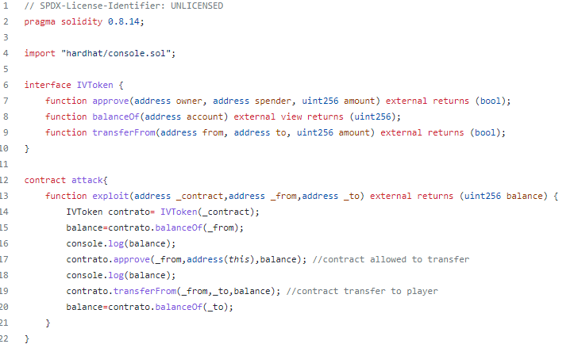

Then we just deploy challenge VToken contract and our attacker contract using the first account as our player account and second account as challenger account:

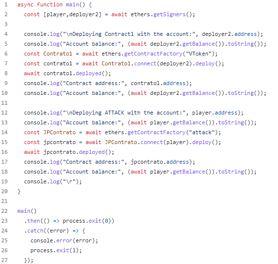

The test file. Just change the addresses (toa and toa2) for your own deployed contracts addresses:

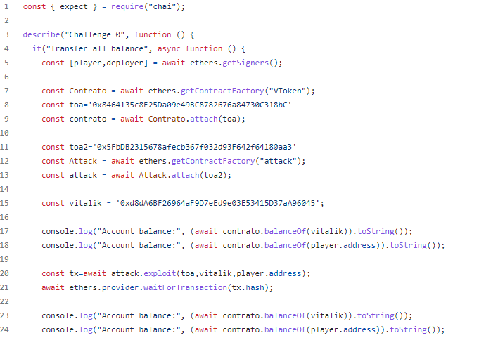

Source Code:
https://github.com/devnet0x/Blockchain/tree/master/ChallengesCTF/A-maze-x/0_Vitatoken

##  Challenge 1: What a nice Lender Pool! ##
Analyzing the contract, what we need to do is try to withdraw ISEC but how can we do that if we dont have any balance?.
When analyze contract vulnerabilities, i’m always start searching for eventual reentrancy points (transfers with post balance update) and delegatecall (to manipulate variables using the same slots). In this case i found a delegatecall inside flashloan function, so it look like we can use this delegatecall to change the following contract global variables:

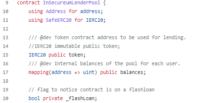

Then, we can change balances using delegatecall function and reusing the same memory slots to set values as we want.
So, let’s create a contract that borrow a flashloan (function exploit), call a custom function (changedata) to set balance to our contract account and withdraw all the ISEC. (after that, you can easily transfer all balance to your player account if you want).

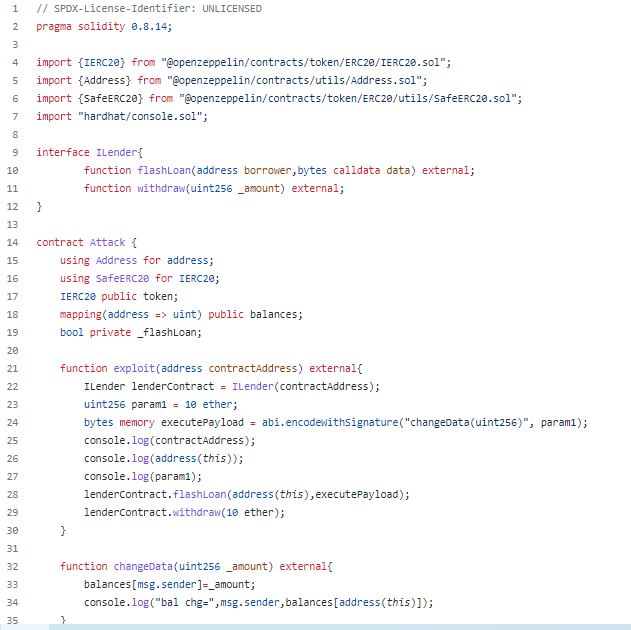

This is the deploy script used to set up challenge:

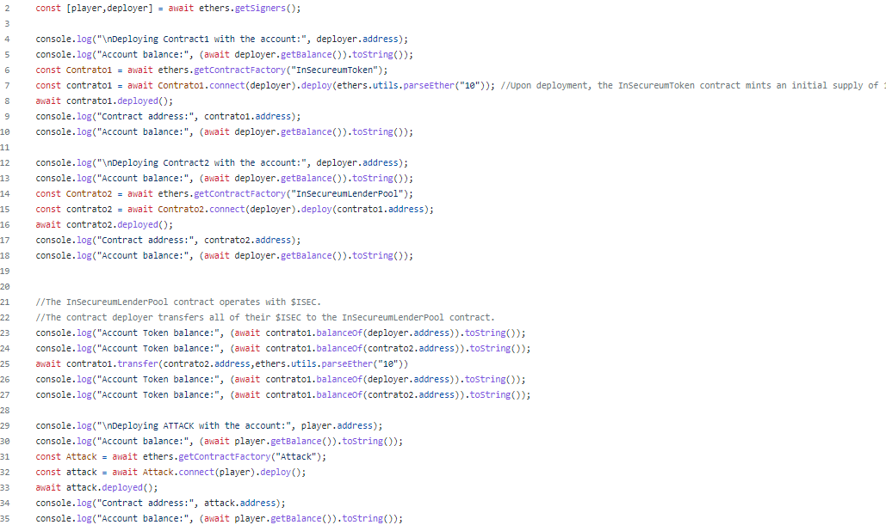

And this is the test sequence (only call to our attackers contract and change contract addresses for those deployed in your environment):

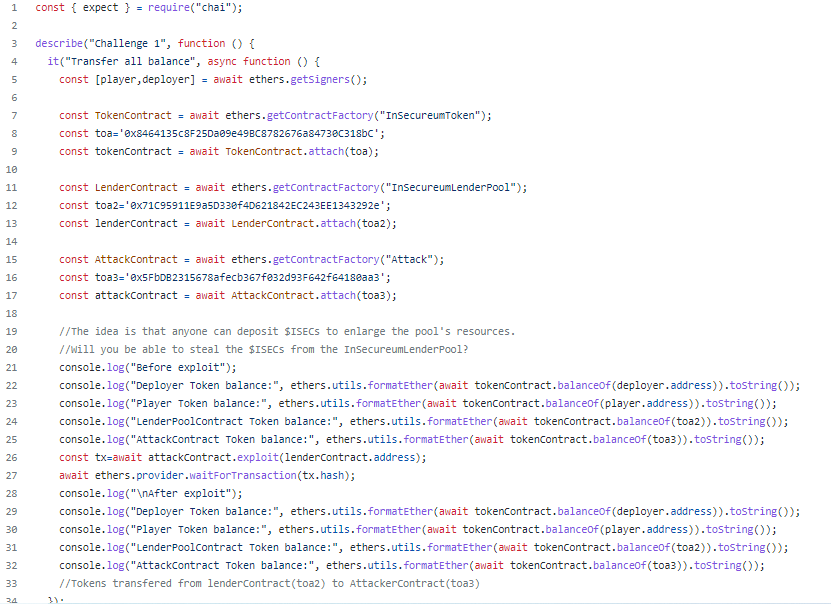

Source Code:
https://github.com/devnet0x/Blockchain/tree/master/ChallengesCTF/A-maze-x/1_LenderPool

## Challenge 2: it's always sunny in decentralized exchanges ##
In this challenge, we need to drain liquidity from the Dex, so analyzing contract we need to removeLiquidity, but how ca we do that if only can remove the same amount that we previously deposited?.
Analyzing removeLiquidity function, we can see a transfer call previous to update balance so it’s a candidate to reentrancy calling this function recursively from a contract’s fallback. But, how can we do a fallback if no ethers transfer?, the answer is in ERC223 token implementation, where we can see a fallback call after transfer (as defined in ERC223 standard):

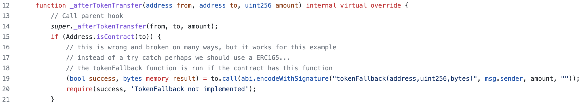

Then we implement a contract which deposit liquidity, and then remove liquidity with a malicious tokenFallback function (after that, you can easily transfer all balance to your player account if you want):

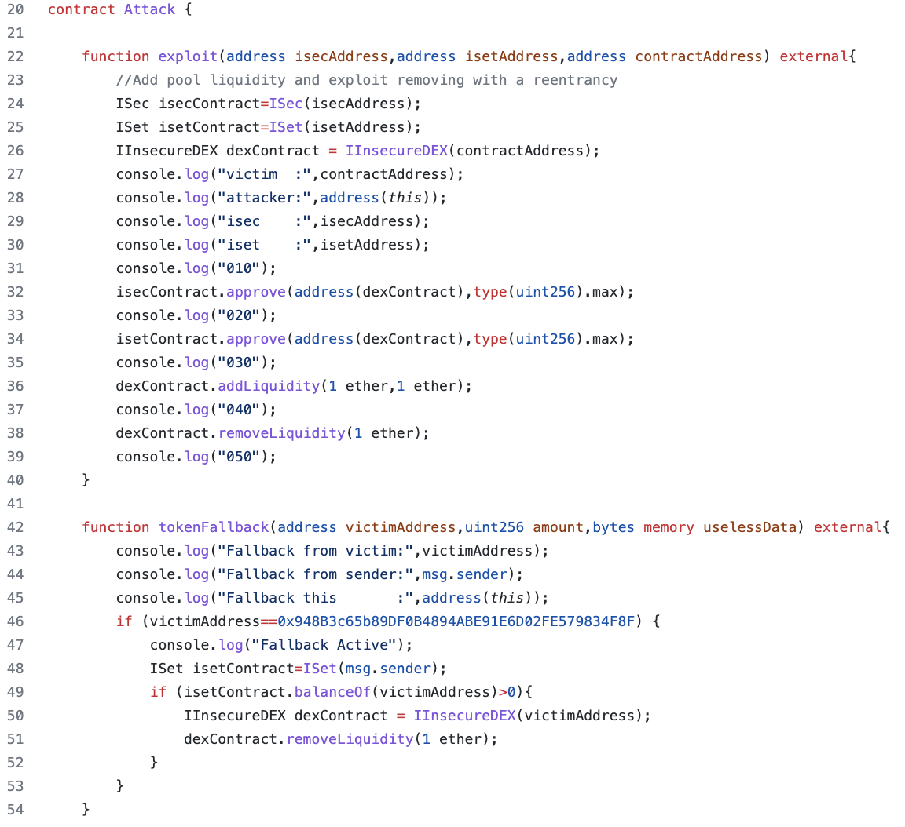

Finally, let’s deploy and setup our challenge (see deploy.js) and runit with this script (test.js):

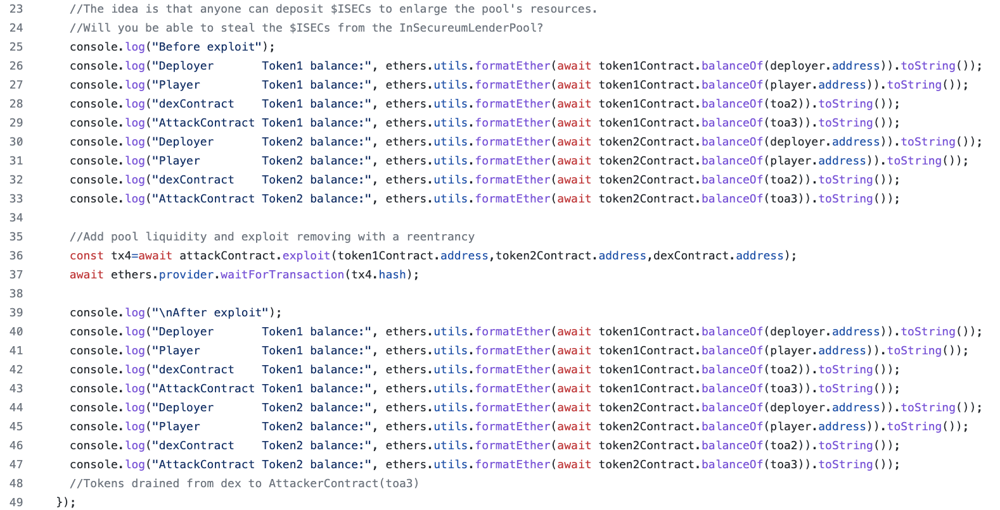

Source Code:
https://github.com/devnet0x/Blockchain/tree/master/ChallengesCTF/A-maze-x/2_Dex

## Challenge 3: borrow, hide and seek ##
Finally, in this challenge, as mentioned in the “familiar concepts section”, we must proceed with a oracle price attack, so lets build a contract which implement all known 4 steps in this kind of attack:

1. Attacker borrows a large amount of token A from a protocol supporting flash loans.

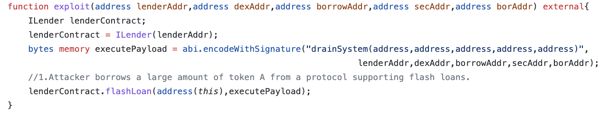

2. Attacker swaps token A for token B on a DEX (lowering the spot price of token A and increasing the spot price of token B on the DEX).

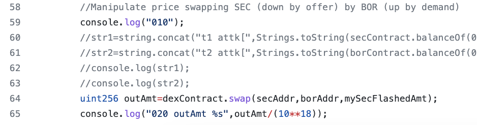

3. Attacker deposits the purchased token B as collateral on a DeFi protocol that uses the spot price from the above DEX as its sole price feed, and uses the manipulated spot price to borrow a larger amount of token A than should normally be possible.

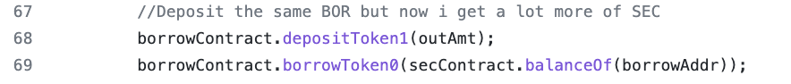

4. Attacker uses a portion of borrowed token A to fully pay back the original flash loan and keep the remaining tokens, generating a profit using the protocol’s manipulated price feed.

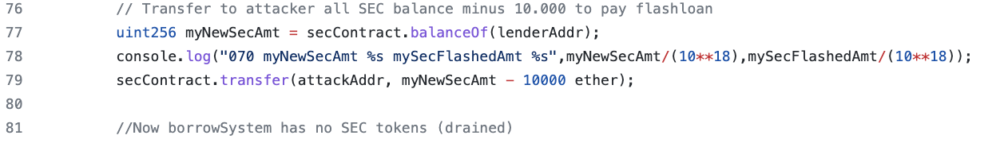

Then, lets deploy and setup our challenge with deploy.js and finally lets test our exploit with test.js (after that, you can easily transfer all balance to your player account if you want).:

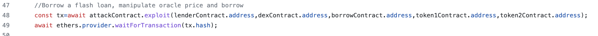

Source Code:

https://github.com/devnet0x/Blockchain/tree/master/ChallengesCTF/A-maze-x/3_Borrower
